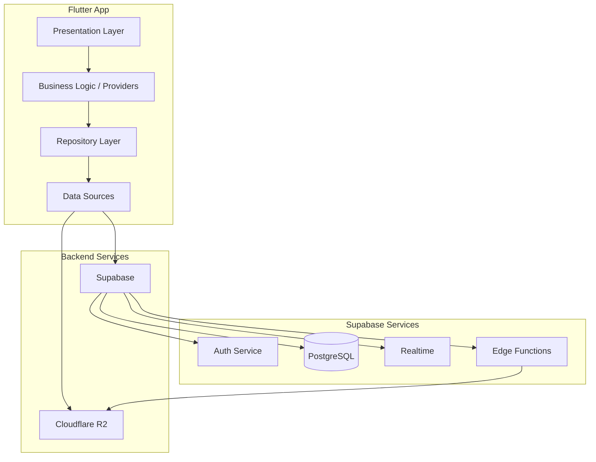
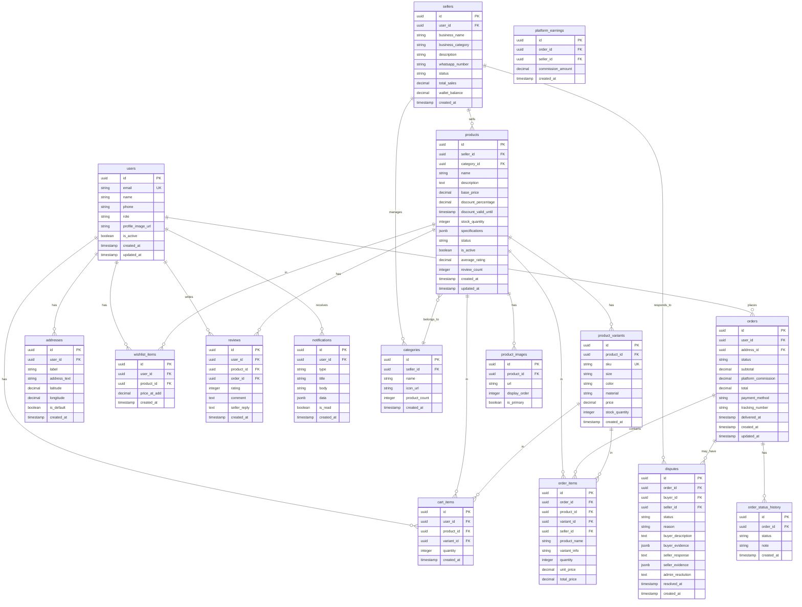

# Design Document: Vendora Backend Enhancement

## Overview

This design document outlines the technical architecture and implementation details for transforming the Vendora Flutter e-commerce application from a UI-only prototype into a fully functional multi-vendor marketplace. The enhancement integrates Supabase for backend services (PostgreSQL database, authentication, real-time subscriptions), Cloudflare R2 for scalable image storage, and comprehensive UI/UX improvements.

The system follows a clean architecture pattern with clear separation between presentation, domain, and data layers. State management uses Provider/Riverpod for reactive UI updates, while Supabase Realtime enables live data synchronization across devices.

## Architecture

### High-Level Architecture



### Layer Responsibilities

1. **Presentation Layer**: Flutter widgets, screens, and UI components
2. **Business Logic Layer**: Providers/Controllers managing state and business rules
3. **Repository Layer**: Abstracts data operations, coordinates between data sources
4. **Data Sources**: Direct communication with Supabase and R2 APIs

### Folder Structure

```
lib/
├── core/
│   ├── config/
│   │   ├── supabase_config.dart
│   │   ├── r2_config.dart
│   │   └── app_constants.dart
│   ├── errors/
│   │   ├── exceptions.dart
│   │   └── failures.dart
│   ├── network/
│   │   ├── network_info.dart
│   │   └── api_client.dart
│   ├── routes/
│   ├── theme/
│   └── widgets/
├── features/
│   ├── auth/
│   │   ├── data/
│   │   │   ├── datasources/
│   │   │   ├── models/
│   │   │   └── repositories/
│   │   ├── domain/
│   │   │   ├── entities/
│   │   │   ├── repositories/
│   │   │   └── usecases/
│   │   └── presentation/
│   │       ├── providers/
│   │       ├── screens/
│   │       └── widgets/
│   ├── products/
│   ├── cart/
│   ├── orders/
│   ├── admin/
│   ├── seller/
│   └── buyer/
├── models/
├── services/
│   ├── image_upload_service.dart
│   ├── notification_service.dart
│   ├── cache_service.dart
│   └── location_service.dart
└── main.dart
```

## Components and Interfaces

### 1. Supabase Client Service

```dart
abstract class ISupabaseService {
  Future<void> initialize();
  SupabaseClient get client;
  GoTrueClient get auth;
  RealtimeClient get realtime;
  bool get isInitialized;
}

class SupabaseService implements ISupabaseService {
  static final SupabaseService _instance = SupabaseService._internal();
  factory SupabaseService() => _instance;
  SupabaseService._internal();
  
  late final SupabaseClient _client;
  bool _isInitialized = false;
  
  @override
  Future<void> initialize() async {
    if (_isInitialized) return;
    
    await Supabase.initialize(
      url: AppConfig.supabaseUrl,
      anonKey: AppConfig.supabaseAnonKey,
    );
    _client = Supabase.instance.client;
    _isInitialized = true;
  }
  
  @override
  SupabaseClient get client => _client;
  
  @override
  GoTrueClient get auth => _client.auth;
  
  @override
  RealtimeClient get realtime => _client.realtime;
  
  @override
  bool get isInitialized => _isInitialized;
}
```

### 2. Authentication Repository

```dart
abstract class IAuthRepository {
  Future<Either<Failure, UserEntity>> signUp({
    required String email,
    required String password,
    required String name,
    required String phone,
    required UserRole role,
  });
  
  Future<Either<Failure, UserEntity>> signIn({
    required String email,
    required String password,
  });
  
  Future<Either<Failure, void>> signOut();
  Future<Either<Failure, void>> resetPassword(String email);
  Future<Either<Failure, UserEntity?>> getCurrentUser();
  Stream<AuthState> get authStateChanges;
}
```

### 3. Image Upload Service (Cloudflare R2)

```dart
abstract class IImageUploadService {
  Future<Either<Failure, String>> uploadImage({
    required File file,
    required String bucket,
    required String path,
  });
  
  Future<Either<Failure, List<String>>> uploadMultipleImages({
    required List<File> files,
    required String bucket,
    required String basePath,
  });
  
  Future<Either<Failure, void>> deleteImage(String url);
}

class R2ImageUploadService implements IImageUploadService {
  final SupabaseService _supabase;
  
  // Uses Supabase Edge Function to generate presigned URLs
  // Then uploads directly to R2
  @override
  Future<Either<Failure, String>> uploadImage({
    required File file,
    required String bucket,
    required String path,
  }) async {
    try {
      // Validate file
      final extension = p.extension(file.path).toLowerCase();
      if (!['jpg', 'jpeg', 'png', 'webp'].contains(extension)) {
        return Left(ValidationFailure('Invalid file type'));
      }
      
      final size = await file.length();
      if (size > 10 * 1024 * 1024) { // 10MB
        return Left(ValidationFailure('File too large'));
      }
      
      // Get presigned URL from Edge Function
      final response = await _supabase.client.functions.invoke(
        'generate-upload-url',
        body: {'bucket': bucket, 'path': path, 'contentType': 'image/$extension'},
      );
      
      final presignedUrl = response.data['uploadUrl'];
      final publicUrl = response.data['publicUrl'];
      
      // Upload to R2
      final bytes = await file.readAsBytes();
      await http.put(
        Uri.parse(presignedUrl),
        body: bytes,
        headers: {'Content-Type': 'image/$extension'},
      );
      
      return Right(publicUrl);
    } catch (e) {
      return Left(ServerFailure(e.toString()));
    }
  }
}
```

### 4. Product Repository

```dart
abstract class IProductRepository {
  Future<Either<Failure, List<Product>>> getProducts({
    int page = 1,
    int limit = 20,
    String? category,
    String? searchQuery,
    ProductSortOption? sortBy,
  });
  
  Future<Either<Failure, Product>> getProductById(String id);
  Future<Either<Failure, Product>> createProduct(ProductCreateDto dto);
  Future<Either<Failure, Product>> updateProduct(String id, ProductUpdateDto dto);
  Future<Either<Failure, void>> deleteProduct(String id);
  Stream<List<Product>> watchSellerProducts(String sellerId);
}
```

### 5. Order State Machine

```dart
enum OrderStatus {
  pending,
  processing,
  shipped,
  delivered,
  cancelled,
}

class OrderStateMachine {
  static const Map<OrderStatus, List<OrderStatus>> _transitions = {
    OrderStatus.pending: [OrderStatus.processing, OrderStatus.cancelled],
    OrderStatus.processing: [OrderStatus.shipped, OrderStatus.cancelled],
    OrderStatus.shipped: [OrderStatus.delivered],
    OrderStatus.delivered: [],
    OrderStatus.cancelled: [],
  };
  
  static bool canTransition(OrderStatus from, OrderStatus to) {
    return _transitions[from]?.contains(to) ?? false;
  }
  
  static Either<Failure, OrderStatus> transition(OrderStatus current, OrderStatus target) {
    if (canTransition(current, target)) {
      return Right(target);
    }
    return Left(ValidationFailure(
      'Cannot transition from ${current.name} to ${target.name}'
    ));
  }
}
```

### 6. Real-time Subscription Manager

```dart
class RealtimeManager {
  final SupabaseService _supabase;
  final Map<String, RealtimeChannel> _channels = {};
  
  void subscribeToOrders(String userId, void Function(Order) onUpdate) {
    final channel = _supabase.realtime.channel('orders:$userId');
    
    channel.on(
      RealtimeListenTypes.postgresChanges,
      ChannelFilter(
        event: '*',
        schema: 'public',
        table: 'orders',
        filter: 'user_id=eq.$userId',
      ),
      (payload, [ref]) {
        final order = Order.fromJson(payload['new']);
        onUpdate(order);
      },
    ).subscribe();
    
    _channels['orders:$userId'] = channel;
  }
  
  void unsubscribe(String channelKey) {
    _channels[channelKey]?.unsubscribe();
    _channels.remove(channelKey);
  }
  
  void dispose() {
    for (final channel in _channels.values) {
      channel.unsubscribe();
    }
    _channels.clear();
  }
}
```


## Data Models

### Database Schema (Supabase PostgreSQL)



### Dart Model Classes

```dart
// User Entity
class UserEntity {
  final String id;
  final String email;
  final String name;
  final String phone;
  final UserRole role;
  final String? profileImageUrl;
  final bool isActive;
  final DateTime createdAt;
  
  const UserEntity({
    required this.id,
    required this.email,
    required this.name,
    required this.phone,
    required this.role,
    this.profileImageUrl,
    this.isActive = true,
    required this.createdAt,
  });
}

// Product Model with JSON serialization
class Product {
  final String id;
  final String sellerId;
  final String? categoryId;
  final String name;
  final String description;
  final double basePrice;
  final double? discountPercentage;
  final DateTime? discountValidUntil;
  final int stockQuantity;
  final Map<String, dynamic> specifications;
  final ProductStatus status;
  final bool isActive;
  final double averageRating;
  final int reviewCount;
  final List<ProductImage> images;
  final List<ProductVariant> variants;
  final DateTime createdAt;
  
  const Product({
    required this.id,
    required this.sellerId,
    this.categoryId,
    required this.name,
    required this.description,
    required this.basePrice,
    this.discountPercentage,
    this.discountValidUntil,
    required this.stockQuantity,
    this.specifications = const {},
    this.status = ProductStatus.pending,
    this.isActive = true,
    this.averageRating = 0.0,
    this.reviewCount = 0,
    this.images = const [],
    this.variants = const [],
    required this.createdAt,
  });
  
  double get currentPrice {
    if (discountPercentage != null && 
        discountValidUntil != null && 
        discountValidUntil!.isAfter(DateTime.now())) {
      return basePrice * (1 - discountPercentage! / 100);
    }
    return basePrice;
  }
  
  bool get isLowStock => stockQuantity > 0 && stockQuantity < 5;
  bool get isOutOfStock => stockQuantity == 0;
  
  factory Product.fromJson(Map<String, dynamic> json) {
    return Product(
      id: json['id'],
      sellerId: json['seller_id'],
      categoryId: json['category_id'],
      name: json['name'],
      description: json['description'],
      basePrice: (json['base_price'] as num).toDouble(),
      discountPercentage: json['discount_percentage']?.toDouble(),
      discountValidUntil: json['discount_valid_until'] != null 
          ? DateTime.parse(json['discount_valid_until']) 
          : null,
      stockQuantity: json['stock_quantity'],
      specifications: json['specifications'] ?? {},
      status: ProductStatus.values.byName(json['status']),
      isActive: json['is_active'] ?? true,
      averageRating: (json['average_rating'] as num?)?.toDouble() ?? 0.0,
      reviewCount: json['review_count'] ?? 0,
      images: (json['product_images'] as List?)
          ?.map((e) => ProductImage.fromJson(e))
          .toList() ?? [],
      variants: (json['product_variants'] as List?)
          ?.map((e) => ProductVariant.fromJson(e))
          .toList() ?? [],
      createdAt: DateTime.parse(json['created_at']),
    );
  }
  
  Map<String, dynamic> toJson() {
    return {
      'id': id,
      'seller_id': sellerId,
      'category_id': categoryId,
      'name': name,
      'description': description,
      'base_price': basePrice,
      'discount_percentage': discountPercentage,
      'discount_valid_until': discountValidUntil?.toIso8601String(),
      'stock_quantity': stockQuantity,
      'specifications': specifications,
      'status': status.name,
      'is_active': isActive,
      'average_rating': averageRating,
      'review_count': reviewCount,
      'created_at': createdAt.toIso8601String(),
    };
  }
}

// Order Model with State Machine
class Order {
  final String id;
  final String userId;
  final String addressId;
  final OrderStatus status;
  final double subtotal;
  final double platformCommission;
  final double total;
  final String paymentMethod;
  final String? trackingNumber;
  final DateTime? deliveredAt;
  final List<OrderItem> items;
  final List<OrderStatusHistory> statusHistory;
  final DateTime createdAt;
  
  const Order({
    required this.id,
    required this.userId,
    required this.addressId,
    required this.status,
    required this.subtotal,
    required this.platformCommission,
    required this.total,
    required this.paymentMethod,
    this.trackingNumber,
    this.deliveredAt,
    this.items = const [],
    this.statusHistory = const [],
    required this.createdAt,
  });
  
  bool get canCancel => 
      status == OrderStatus.pending || status == OrderStatus.processing;
  
  bool get canDispute => 
      status == OrderStatus.delivered &&
      DateTime.now().difference(deliveredAt!).inDays <= 7;
  
  factory Order.fromJson(Map<String, dynamic> json) {
    return Order(
      id: json['id'],
      userId: json['user_id'],
      addressId: json['address_id'],
      status: OrderStatus.values.byName(json['status']),
      subtotal: (json['subtotal'] as num).toDouble(),
      platformCommission: (json['platform_commission'] as num).toDouble(),
      total: (json['total'] as num).toDouble(),
      paymentMethod: json['payment_method'],
      trackingNumber: json['tracking_number'],
      deliveredAt: json['delivered_at'] != null 
          ? DateTime.parse(json['delivered_at']) 
          : null,
      items: (json['order_items'] as List?)
          ?.map((e) => OrderItem.fromJson(e))
          .toList() ?? [],
      statusHistory: (json['order_status_history'] as List?)
          ?.map((e) => OrderStatusHistory.fromJson(e))
          .toList() ?? [],
      createdAt: DateTime.parse(json['created_at']),
    );
  }
  
  Map<String, dynamic> toJson() {
    return {
      'id': id,
      'user_id': userId,
      'address_id': addressId,
      'status': status.name,
      'subtotal': subtotal,
      'platform_commission': platformCommission,
      'total': total,
      'payment_method': paymentMethod,
      'tracking_number': trackingNumber,
      'delivered_at': deliveredAt?.toIso8601String(),
      'created_at': createdAt.toIso8601String(),
    };
  }
}

// Address with GPS coordinates
class Address {
  final String id;
  final String userId;
  final String label;
  final String addressText;
  final double latitude;
  final double longitude;
  final bool isDefault;
  final DateTime createdAt;
  
  const Address({
    required this.id,
    required this.userId,
    required this.label,
    required this.addressText,
    required this.latitude,
    required this.longitude,
    this.isDefault = false,
    required this.createdAt,
  });
  
  String get mapsUrl => 
      'https://www.openstreetmap.org/?mlat=$latitude&mlon=$longitude#map=17/$latitude/$longitude';
  
  factory Address.fromJson(Map<String, dynamic> json) {
    return Address(
      id: json['id'],
      userId: json['user_id'],
      label: json['label'],
      addressText: json['address_text'],
      latitude: (json['latitude'] as num).toDouble(),
      longitude: (json['longitude'] as num).toDouble(),
      isDefault: json['is_default'] ?? false,
      createdAt: DateTime.parse(json['created_at']),
    );
  }
  
  Map<String, dynamic> toJson() {
    return {
      'id': id,
      'user_id': userId,
      'label': label,
      'address_text': addressText,
      'latitude': latitude,
      'longitude': longitude,
      'is_default': isDefault,
      'created_at': createdAt.toIso8601String(),
    };
  }
}
```


## Correctness Properties

*A property is a characteristic or behavior that should hold true across all valid executions of a system-essentially, a formal statement about what the system should do. Properties serve as the bridge between human-readable specifications and machine-verifiable correctness guarantees.*

Based on the acceptance criteria analysis, the following correctness properties must be validated through property-based testing:

### Property 1: Model Serialization Round-Trip

*For any* valid model object (User, Product, Order, Address, Review, etc.), serializing to JSON and then deserializing back SHALL produce an equivalent object with all fields preserved.

**Validates: Requirements 11.1, 11.2, 11.3**

This is the most critical property for data integrity. All model classes must implement `toJson()` and `fromJson()` methods that are perfect inverses of each other.

### Property 2: Order State Machine Transitions

*For any* order with a given status, the system SHALL only allow transitions to valid next states as defined by the state machine:
- Pending → Processing, Cancelled
- Processing → Shipped, Cancelled  
- Shipped → Delivered
- Delivered → (terminal)
- Cancelled → (terminal)

*For any* invalid transition attempt, the system SHALL reject the transition and return an error.

**Validates: Requirements 7.3, 7.4, 7.5, 7.6**

### Property 3: Stock Decrement on Order Placement

*For any* order containing products (with or without variants), when the order is placed, the stock quantity for each ordered item SHALL decrease by exactly the ordered quantity. The resulting stock SHALL never be negative.

**Validates: Requirements 16.4, 23.6**

### Property 4: Commission Calculation Accuracy

*For any* delivered order with total amount T, the platform commission SHALL be exactly T × 0.10 (10%), and the seller credit SHALL be exactly T × 0.90 (90%). The sum of commission and seller credit SHALL equal the order total.

**Validates: Requirements 17.1, 17.2**

### Property 5: Category Filter Correctness

*For any* category filter applied to the product catalog, all returned products SHALL belong to the selected category, and no products from other categories SHALL be included.

**Validates: Requirements 5.3**

### Property 6: Product Sort Order Correctness

*For any* sort option (price ascending, price descending, rating, newest), the returned product list SHALL be correctly ordered according to the selected criterion.

**Validates: Requirements 5.4**

### Property 7: Cart Total Calculation

*For any* cart with items, the subtotal SHALL equal the sum of (quantity × unit_price) for all items. When quantities are updated, the total SHALL be recalculated correctly.

**Validates: Requirements 6.2**

### Property 8: Seller Product Isolation

*For any* seller viewing their products, the returned list SHALL contain only products where seller_id matches the authenticated seller's ID. No products from other sellers SHALL be visible.

**Validates: Requirements 4.4**

### Property 9: Approved Products Only for Buyers

*For any* buyer browsing the product catalog, only products with status='approved' AND is_active=true SHALL be visible. Pending, rejected, or inactive products SHALL not appear.

**Validates: Requirements 5.1**

### Property 10: Review Purchase Verification

*For any* review submission attempt, the system SHALL verify that the user has a completed (delivered) order containing the product. Reviews from users who have not purchased the product SHALL be rejected.

**Validates: Requirements 19.5, 19.6**

### Property 11: Dispute Window Validation

*For any* dispute creation attempt, the system SHALL verify that the order status is 'delivered' AND the current date is within 7 days of the delivery date. Disputes outside this window SHALL be rejected.

**Validates: Requirements 21.1**

### Property 12: Low Stock Badge Display

*For any* product with 0 < stock_quantity < 5, the isLowStock computed property SHALL return true. For stock_quantity >= 5 or stock_quantity = 0, isLowStock SHALL return false.

**Validates: Requirements 16.1**

### Property 13: Out of Stock State

*For any* product with stock_quantity = 0, the isOutOfStock computed property SHALL return true, and the Add to Cart action SHALL be disabled.

**Validates: Requirements 16.3**

### Property 14: Quantity Validation Non-Negative

*For any* stock quantity update attempt with a negative value, the system SHALL reject the update and return a validation error.

**Validates: Requirements 16.2**

### Property 15: New Seller Pending Status

*For any* newly registered seller, the initial status SHALL be 'unverified' (pending). The seller SHALL not be able to create products until status is 'active'.

**Validates: Requirements 2.8, 18.1, 18.2**

### Property 16: Image Upload Validation

*For any* image upload attempt, the system SHALL validate:
- File type is one of: JPEG, PNG, WebP
- File size is <= 10MB
Invalid files SHALL be rejected with appropriate error messages.

**Validates: Requirements 3.6**

### Property 17: Date ISO 8601 Format

*For any* date stored in the database, the format SHALL be ISO 8601 (e.g., "2025-12-27T10:30:00Z"). Parsing and formatting SHALL be consistent across all platforms.

**Validates: Requirements 11.4**

### Property 18: Variant Stock Independence

*For any* product with variants, each variant SHALL have independent stock_quantity. Ordering one variant SHALL only decrement that variant's stock, not other variants or the base product.

**Validates: Requirements 23.2, 23.6, 23.7**

## Error Handling

### Error Types

```dart
abstract class Failure {
  final String message;
  const Failure(this.message);
}

class ServerFailure extends Failure {
  const ServerFailure(super.message);
}

class NetworkFailure extends Failure {
  const NetworkFailure(super.message);
}

class AuthFailure extends Failure {
  final AuthErrorType type;
  const AuthFailure(super.message, this.type);
}

class ValidationFailure extends Failure {
  final Map<String, String>? fieldErrors;
  const ValidationFailure(super.message, {this.fieldErrors});
}

class CacheFailure extends Failure {
  const CacheFailure(super.message);
}

enum AuthErrorType {
  invalidCredentials,
  emailNotVerified,
  userNotFound,
  weakPassword,
  emailInUse,
  sessionExpired,
}
```

### Error Handling Strategy

1. **Network Errors**: Display offline indicator, use cached data, queue operations for retry
2. **Authentication Errors**: Clear session, redirect to login with appropriate message
3. **Validation Errors**: Display inline field errors, highlight invalid fields
4. **Server Errors**: Display user-friendly message with retry option
5. **Rate Limiting**: Implement exponential backoff, show "Please wait" message

### Retry Logic

```dart
class RetryPolicy {
  static const int maxAttempts = 3;
  static const Duration initialDelay = Duration(seconds: 1);
  
  static Future<T> execute<T>(Future<T> Function() operation) async {
    int attempts = 0;
    Duration delay = initialDelay;
    
    while (attempts < maxAttempts) {
      try {
        return await operation();
      } catch (e) {
        attempts++;
        if (attempts >= maxAttempts) rethrow;
        await Future.delayed(delay);
        delay *= 2; // Exponential backoff
      }
    }
    throw Exception('Max retry attempts exceeded');
  }
}
```

## Testing Strategy

### Dual Testing Approach

The testing strategy combines unit tests for specific examples and edge cases with property-based tests for universal correctness guarantees.

### Property-Based Testing Framework

**Library**: `fast_check` (Dart port of fast-check)

```yaml
dev_dependencies:
  fast_check: ^0.1.0
  test: ^1.24.0
```

### Property Test Configuration

- Minimum iterations: 100 per property
- Shrinking enabled for counterexample minimization
- Seed logging for reproducibility

### Test Organization

```
test/
├── unit/
│   ├── models/
│   │   ├── product_test.dart
│   │   ├── order_test.dart
│   │   └── user_test.dart
│   ├── services/
│   │   ├── cart_service_test.dart
│   │   └── order_service_test.dart
│   └── utils/
│       └── validators_test.dart
├── property/
│   ├── serialization_property_test.dart
│   ├── order_state_machine_property_test.dart
│   ├── stock_management_property_test.dart
│   ├── commission_property_test.dart
│   └── filter_sort_property_test.dart
├── integration/
│   ├── auth_integration_test.dart
│   ├── product_integration_test.dart
│   └── order_integration_test.dart
└── widget/
    ├── home_screen_test.dart
    ├── cart_screen_test.dart
    └── checkout_screen_test.dart
```

### Property Test Example

```dart
// **Feature: vendora-backend-enhancement, Property 1: Model Serialization Round-Trip**
// **Validates: Requirements 11.1, 11.2, 11.3**
void main() {
  group('Model Serialization Round-Trip', () {
    test('Product serialization round-trip preserves all fields', () {
      fc.assert(
        fc.property(
          productArbitrary(),
          (product) {
            final json = product.toJson();
            final restored = Product.fromJson(json);
            
            expect(restored.id, equals(product.id));
            expect(restored.name, equals(product.name));
            expect(restored.basePrice, equals(product.basePrice));
            expect(restored.stockQuantity, equals(product.stockQuantity));
            expect(restored.specifications, equals(product.specifications));
            expect(restored.createdAt.toIso8601String(), 
                   equals(product.createdAt.toIso8601String()));
          },
        ),
        numRuns: 100,
      );
    });
    
    test('Order serialization round-trip preserves all fields', () {
      fc.assert(
        fc.property(
          orderArbitrary(),
          (order) {
            final json = order.toJson();
            final restored = Order.fromJson(json);
            
            expect(restored.id, equals(order.id));
            expect(restored.status, equals(order.status));
            expect(restored.total, equals(order.total));
            expect(restored.platformCommission, equals(order.platformCommission));
          },
        ),
        numRuns: 100,
      );
    });
  });
}

// **Feature: vendora-backend-enhancement, Property 2: Order State Machine Transitions**
// **Validates: Requirements 7.3, 7.4, 7.5, 7.6**
void main() {
  group('Order State Machine', () {
    test('valid transitions are allowed', () {
      fc.assert(
        fc.property(
          validTransitionArbitrary(),
          (transition) {
            final result = OrderStateMachine.transition(
              transition.from, 
              transition.to,
            );
            expect(result.isRight(), isTrue);
          },
        ),
        numRuns: 100,
      );
    });
    
    test('invalid transitions are rejected', () {
      fc.assert(
        fc.property(
          invalidTransitionArbitrary(),
          (transition) {
            final result = OrderStateMachine.transition(
              transition.from, 
              transition.to,
            );
            expect(result.isLeft(), isTrue);
          },
        ),
        numRuns: 100,
      );
    });
  });
}

// **Feature: vendora-backend-enhancement, Property 4: Commission Calculation Accuracy**
// **Validates: Requirements 17.1, 17.2**
void main() {
  group('Commission Calculation', () {
    test('commission is exactly 10% of order total', () {
      fc.assert(
        fc.property(
          fc.double_(min: 0.01, max: 1000000),
          (orderTotal) {
            final commission = CommissionCalculator.calculate(orderTotal);
            final sellerAmount = CommissionCalculator.sellerAmount(orderTotal);
            
            expect(commission, closeTo(orderTotal * 0.10, 0.01));
            expect(sellerAmount, closeTo(orderTotal * 0.90, 0.01));
            expect(commission + sellerAmount, closeTo(orderTotal, 0.01));
          },
        ),
        numRuns: 100,
      );
    });
  });
}
```

### Test Generators (Arbitraries)

```dart
Arbitrary<Product> productArbitrary() {
  return fc.record({
    'id': fc.uuid(),
    'sellerId': fc.uuid(),
    'name': fc.string(minLength: 1, maxLength: 100),
    'description': fc.string(maxLength: 1000),
    'basePrice': fc.double_(min: 0.01, max: 1000000),
    'stockQuantity': fc.integer(min: 0, max: 10000),
    'status': fc.constantFrom(ProductStatus.values),
    'createdAt': fc.dateTime(),
  }).map((record) => Product(
    id: record['id'],
    sellerId: record['sellerId'],
    name: record['name'],
    description: record['description'],
    basePrice: record['basePrice'],
    stockQuantity: record['stockQuantity'],
    status: record['status'],
    createdAt: record['createdAt'],
  ));
}

Arbitrary<OrderTransition> validTransitionArbitrary() {
  return fc.constantFrom([
    OrderTransition(OrderStatus.pending, OrderStatus.processing),
    OrderTransition(OrderStatus.pending, OrderStatus.cancelled),
    OrderTransition(OrderStatus.processing, OrderStatus.shipped),
    OrderTransition(OrderStatus.processing, OrderStatus.cancelled),
    OrderTransition(OrderStatus.shipped, OrderStatus.delivered),
  ]);
}
```

### Unit Test Coverage

Unit tests cover:
- Edge cases (empty inputs, boundary values)
- Error conditions (invalid data, network failures)
- Specific business logic scenarios
- Widget rendering and interactions

### Integration Test Coverage

Integration tests verify:
- Supabase authentication flow
- Database CRUD operations
- Real-time subscription updates
- Image upload to R2
- End-to-end order flow


## UI/UX Design Patterns

> **Note:** For comprehensive UI/UX specifications including wireframes, component designs, and animations for all three user roles (Buyer, Seller, Admin), see the separate [UI Design Document](./ui-design.md).

### Loading States

```dart
class SkeletonLoader extends StatelessWidget {
  final double width;
  final double height;
  final double borderRadius;
  
  const SkeletonLoader({
    this.width = double.infinity,
    this.height = 20,
    this.borderRadius = 8,
  });
  
  @override
  Widget build(BuildContext context) {
    return Shimmer.fromColors(
      baseColor: Colors.grey[300]!,
      highlightColor: Colors.grey[100]!,
      child: Container(
        width: width,
        height: height,
        decoration: BoxDecoration(
          color: Colors.white,
          borderRadius: BorderRadius.circular(borderRadius),
        ),
      ),
    );
  }
}
```

### Pull-to-Refresh Pattern

```dart
RefreshIndicator(
  onRefresh: () => context.read<ProductProvider>().refresh(),
  child: ListView.builder(...),
)
```

### Error State Widget

```dart
class ErrorStateWidget extends StatelessWidget {
  final String message;
  final VoidCallback onRetry;
  
  @override
  Widget build(BuildContext context) {
    return Center(
      child: Column(
        mainAxisAlignment: MainAxisAlignment.center,
        children: [
          Icon(Icons.error_outline, size: 64, color: Colors.grey),
          SizedBox(height: 16),
          Text(message, textAlign: TextAlign.center),
          SizedBox(height: 16),
          ElevatedButton(
            onPressed: onRetry,
            child: Text('Try Again'),
          ),
        ],
      ),
    );
  }
}
```

### Image Gallery with Zoom

```dart
class ProductImageGallery extends StatelessWidget {
  final List<String> imageUrls;
  
  @override
  Widget build(BuildContext context) {
    return PageView.builder(
      itemCount: imageUrls.length,
      itemBuilder: (context, index) {
        return InteractiveViewer(
          minScale: 1.0,
          maxScale: 4.0,
          child: CachedNetworkImage(
            imageUrl: imageUrls[index],
            fit: BoxFit.contain,
            placeholder: (_, __) => SkeletonLoader(height: 300),
            errorWidget: (_, __, ___) => Icon(Icons.broken_image),
          ),
        );
      },
    );
  }
}
```

### OpenStreetMap Location Picker

```dart
class LocationPickerWidget extends StatefulWidget {
  final LatLng? initialLocation;
  final Function(LatLng) onLocationSelected;
  
  @override
  State<LocationPickerWidget> createState() => _LocationPickerWidgetState();
}

class _LocationPickerWidgetState extends State<LocationPickerWidget> {
  late LatLng _selectedLocation;
  
  @override
  void initState() {
    super.initState();
    _selectedLocation = widget.initialLocation ?? 
        LatLng(31.5204, 74.3587); // Default: Lahore, Pakistan
  }
  
  @override
  Widget build(BuildContext context) {
    return FlutterMap(
      options: MapOptions(
        center: _selectedLocation,
        zoom: 15,
        onTap: (tapPosition, latLng) {
          setState(() => _selectedLocation = latLng);
          widget.onLocationSelected(latLng);
        },
      ),
      children: [
        TileLayer(
          urlTemplate: 'https://tile.openstreetmap.org/{z}/{x}/{y}.png',
          userAgentPackageName: 'com.vendora.app',
        ),
        MarkerLayer(
          markers: [
            Marker(
              point: _selectedLocation,
              child: Icon(Icons.location_pin, color: Colors.red, size: 40),
            ),
          ],
        ),
      ],
    );
  }
}
```

## Dependencies

### pubspec.yaml additions

```yaml
dependencies:
  # Supabase
  supabase_flutter: ^2.3.0
  
  # State Management
  flutter_riverpod: ^2.4.0
  
  # Networking & Caching
  dio: ^5.4.0
  cached_network_image: ^3.3.0
  hive_flutter: ^1.1.0
  
  # Maps
  flutter_map: ^6.1.0
  latlong2: ^0.9.0
  
  # Charts
  fl_chart: ^0.66.0
  
  # UI Enhancements
  shimmer: ^3.0.0
  flutter_rating_bar: ^4.0.1
  
  # Utilities
  url_launcher: ^6.2.0
  image_picker: ^1.0.0
  path: ^1.8.0
  dartz: ^0.10.1
  equatable: ^2.0.5
  intl: ^0.18.0
  connectivity_plus: ^5.0.0

dev_dependencies:
  fast_check: ^0.1.0
  mocktail: ^1.0.0
  flutter_test:
    sdk: flutter
```

## Supabase Edge Functions

### Generate Upload URL (for R2)

```typescript
// supabase/functions/generate-upload-url/index.ts
import { serve } from 'https://deno.land/std@0.168.0/http/server.ts'
import { S3Client, PutObjectCommand } from 'npm:@aws-sdk/client-s3'
import { getSignedUrl } from 'npm:@aws-sdk/s3-request-presigner'

const s3Client = new S3Client({
  region: 'auto',
  endpoint: Deno.env.get('R2_ENDPOINT'),
  credentials: {
    accessKeyId: Deno.env.get('R2_ACCESS_KEY_ID')!,
    secretAccessKey: Deno.env.get('R2_SECRET_ACCESS_KEY')!,
  },
})

serve(async (req) => {
  const { bucket, path, contentType } = await req.json()
  
  const command = new PutObjectCommand({
    Bucket: bucket,
    Key: path,
    ContentType: contentType,
  })
  
  const uploadUrl = await getSignedUrl(s3Client, command, { expiresIn: 3600 })
  const publicUrl = `${Deno.env.get('R2_PUBLIC_URL')}/${path}`
  
  return new Response(
    JSON.stringify({ uploadUrl, publicUrl }),
    { headers: { 'Content-Type': 'application/json' } }
  )
})
```

## Database Migrations

### Initial Schema

```sql
-- Enable UUID extension
CREATE EXTENSION IF NOT EXISTS "uuid-ossp";

-- Users table (extends Supabase auth.users)
CREATE TABLE public.users (
  id UUID PRIMARY KEY REFERENCES auth.users(id) ON DELETE CASCADE,
  email TEXT UNIQUE NOT NULL,
  name TEXT NOT NULL,
  phone TEXT,
  role TEXT NOT NULL CHECK (role IN ('buyer', 'seller', 'admin')),
  profile_image_url TEXT,
  is_active BOOLEAN DEFAULT true,
  created_at TIMESTAMPTZ DEFAULT NOW(),
  updated_at TIMESTAMPTZ DEFAULT NOW()
);

-- Sellers table
CREATE TABLE public.sellers (
  id UUID PRIMARY KEY DEFAULT uuid_generate_v4(),
  user_id UUID UNIQUE REFERENCES public.users(id) ON DELETE CASCADE,
  business_name TEXT NOT NULL,
  business_category TEXT NOT NULL,
  description TEXT,
  whatsapp_number TEXT,
  status TEXT DEFAULT 'unverified' CHECK (status IN ('unverified', 'active', 'rejected')),
  total_sales DECIMAL(12,2) DEFAULT 0,
  wallet_balance DECIMAL(12,2) DEFAULT 0,
  created_at TIMESTAMPTZ DEFAULT NOW()
);

-- Categories table
CREATE TABLE public.categories (
  id UUID PRIMARY KEY DEFAULT uuid_generate_v4(),
  seller_id UUID REFERENCES public.sellers(id) ON DELETE CASCADE,
  name TEXT NOT NULL,
  icon_url TEXT,
  product_count INTEGER DEFAULT 0,
  created_at TIMESTAMPTZ DEFAULT NOW()
);

-- Products table
CREATE TABLE public.products (
  id UUID PRIMARY KEY DEFAULT uuid_generate_v4(),
  seller_id UUID NOT NULL REFERENCES public.sellers(id) ON DELETE CASCADE,
  category_id UUID REFERENCES public.categories(id) ON DELETE SET NULL,
  name TEXT NOT NULL,
  description TEXT,
  base_price DECIMAL(12,2) NOT NULL,
  discount_percentage DECIMAL(5,2),
  discount_valid_until TIMESTAMPTZ,
  stock_quantity INTEGER NOT NULL DEFAULT 0,
  specifications JSONB DEFAULT '{}',
  status TEXT DEFAULT 'pending' CHECK (status IN ('pending', 'approved', 'rejected')),
  is_active BOOLEAN DEFAULT true,
  average_rating DECIMAL(3,2) DEFAULT 0,
  review_count INTEGER DEFAULT 0,
  created_at TIMESTAMPTZ DEFAULT NOW(),
  updated_at TIMESTAMPTZ DEFAULT NOW()
);

-- Product variants table
CREATE TABLE public.product_variants (
  id UUID PRIMARY KEY DEFAULT uuid_generate_v4(),
  product_id UUID NOT NULL REFERENCES public.products(id) ON DELETE CASCADE,
  sku TEXT UNIQUE NOT NULL,
  size TEXT,
  color TEXT,
  material TEXT,
  price DECIMAL(12,2) NOT NULL,
  stock_quantity INTEGER NOT NULL DEFAULT 0,
  created_at TIMESTAMPTZ DEFAULT NOW()
);

-- Product images table
CREATE TABLE public.product_images (
  id UUID PRIMARY KEY DEFAULT uuid_generate_v4(),
  product_id UUID NOT NULL REFERENCES public.products(id) ON DELETE CASCADE,
  url TEXT NOT NULL,
  display_order INTEGER DEFAULT 0,
  is_primary BOOLEAN DEFAULT false
);

-- Addresses table
CREATE TABLE public.addresses (
  id UUID PRIMARY KEY DEFAULT uuid_generate_v4(),
  user_id UUID NOT NULL REFERENCES public.users(id) ON DELETE CASCADE,
  label TEXT NOT NULL,
  address_text TEXT NOT NULL,
  latitude DECIMAL(10,8) NOT NULL,
  longitude DECIMAL(11,8) NOT NULL,
  is_default BOOLEAN DEFAULT false,
  created_at TIMESTAMPTZ DEFAULT NOW()
);

-- Orders table
CREATE TABLE public.orders (
  id UUID PRIMARY KEY DEFAULT uuid_generate_v4(),
  user_id UUID NOT NULL REFERENCES public.users(id),
  address_id UUID NOT NULL REFERENCES public.addresses(id),
  status TEXT DEFAULT 'pending' CHECK (status IN ('pending', 'processing', 'shipped', 'delivered', 'cancelled')),
  subtotal DECIMAL(12,2) NOT NULL,
  platform_commission DECIMAL(12,2) NOT NULL,
  total DECIMAL(12,2) NOT NULL,
  payment_method TEXT NOT NULL,
  tracking_number TEXT,
  delivered_at TIMESTAMPTZ,
  created_at TIMESTAMPTZ DEFAULT NOW(),
  updated_at TIMESTAMPTZ DEFAULT NOW()
);

-- Order items table
CREATE TABLE public.order_items (
  id UUID PRIMARY KEY DEFAULT uuid_generate_v4(),
  order_id UUID NOT NULL REFERENCES public.orders(id) ON DELETE CASCADE,
  product_id UUID NOT NULL REFERENCES public.products(id),
  variant_id UUID REFERENCES public.product_variants(id),
  seller_id UUID NOT NULL REFERENCES public.sellers(id),
  product_name TEXT NOT NULL,
  variant_info TEXT,
  quantity INTEGER NOT NULL,
  unit_price DECIMAL(12,2) NOT NULL,
  total_price DECIMAL(12,2) NOT NULL
);

-- Cart items table
CREATE TABLE public.cart_items (
  id UUID PRIMARY KEY DEFAULT uuid_generate_v4(),
  user_id UUID NOT NULL REFERENCES public.users(id) ON DELETE CASCADE,
  product_id UUID NOT NULL REFERENCES public.products(id) ON DELETE CASCADE,
  variant_id UUID REFERENCES public.product_variants(id) ON DELETE CASCADE,
  quantity INTEGER NOT NULL DEFAULT 1,
  created_at TIMESTAMPTZ DEFAULT NOW(),
  UNIQUE(user_id, product_id, variant_id)
);

-- Reviews table
CREATE TABLE public.reviews (
  id UUID PRIMARY KEY DEFAULT uuid_generate_v4(),
  user_id UUID NOT NULL REFERENCES public.users(id),
  product_id UUID NOT NULL REFERENCES public.products(id) ON DELETE CASCADE,
  order_id UUID NOT NULL REFERENCES public.orders(id),
  rating INTEGER NOT NULL CHECK (rating >= 1 AND rating <= 5),
  comment TEXT,
  seller_reply TEXT,
  created_at TIMESTAMPTZ DEFAULT NOW(),
  UNIQUE(user_id, product_id)
);

-- Wishlist table
CREATE TABLE public.wishlist_items (
  id UUID PRIMARY KEY DEFAULT uuid_generate_v4(),
  user_id UUID NOT NULL REFERENCES public.users(id) ON DELETE CASCADE,
  product_id UUID NOT NULL REFERENCES public.products(id) ON DELETE CASCADE,
  price_at_add DECIMAL(12,2) NOT NULL,
  created_at TIMESTAMPTZ DEFAULT NOW(),
  UNIQUE(user_id, product_id)
);

-- Notifications table
CREATE TABLE public.notifications (
  id UUID PRIMARY KEY DEFAULT uuid_generate_v4(),
  user_id UUID NOT NULL REFERENCES public.users(id) ON DELETE CASCADE,
  type TEXT NOT NULL,
  title TEXT NOT NULL,
  body TEXT,
  data JSONB DEFAULT '{}',
  is_read BOOLEAN DEFAULT false,
  created_at TIMESTAMPTZ DEFAULT NOW()
);

-- Disputes table
CREATE TABLE public.disputes (
  id UUID PRIMARY KEY DEFAULT uuid_generate_v4(),
  order_id UUID NOT NULL REFERENCES public.orders(id),
  buyer_id UUID NOT NULL REFERENCES public.users(id),
  seller_id UUID NOT NULL REFERENCES public.sellers(id),
  status TEXT DEFAULT 'pending' CHECK (status IN ('pending', 'seller_responded', 'refunded', 'closed')),
  reason TEXT NOT NULL,
  buyer_description TEXT,
  buyer_evidence JSONB DEFAULT '[]',
  seller_response TEXT,
  seller_evidence JSONB DEFAULT '[]',
  admin_resolution TEXT,
  resolved_at TIMESTAMPTZ,
  created_at TIMESTAMPTZ DEFAULT NOW()
);

-- Platform earnings table
CREATE TABLE public.platform_earnings (
  id UUID PRIMARY KEY DEFAULT uuid_generate_v4(),
  order_id UUID NOT NULL REFERENCES public.orders(id),
  seller_id UUID NOT NULL REFERENCES public.sellers(id),
  commission_amount DECIMAL(12,2) NOT NULL,
  created_at TIMESTAMPTZ DEFAULT NOW()
);

-- Order status history table
CREATE TABLE public.order_status_history (
  id UUID PRIMARY KEY DEFAULT uuid_generate_v4(),
  order_id UUID NOT NULL REFERENCES public.orders(id) ON DELETE CASCADE,
  status TEXT NOT NULL,
  note TEXT,
  created_at TIMESTAMPTZ DEFAULT NOW()
);

-- RLS Policies
ALTER TABLE public.users ENABLE ROW LEVEL SECURITY;
ALTER TABLE public.sellers ENABLE ROW LEVEL SECURITY;
ALTER TABLE public.products ENABLE ROW LEVEL SECURITY;
ALTER TABLE public.orders ENABLE ROW LEVEL SECURITY;
ALTER TABLE public.cart_items ENABLE ROW LEVEL SECURITY;
ALTER TABLE public.addresses ENABLE ROW LEVEL SECURITY;
ALTER TABLE public.reviews ENABLE ROW LEVEL SECURITY;
ALTER TABLE public.wishlist_items ENABLE ROW LEVEL SECURITY;
ALTER TABLE public.notifications ENABLE ROW LEVEL SECURITY;
ALTER TABLE public.disputes ENABLE ROW LEVEL SECURITY;

-- Users can read their own data
CREATE POLICY "Users can read own data" ON public.users
  FOR SELECT USING (auth.uid() = id);

-- Buyers can view approved products
CREATE POLICY "Anyone can view approved products" ON public.products
  FOR SELECT USING (status = 'approved' AND is_active = true);

-- Sellers can manage their own products
CREATE POLICY "Sellers can manage own products" ON public.products
  FOR ALL USING (seller_id IN (
    SELECT id FROM public.sellers WHERE user_id = auth.uid()
  ));

-- Users can manage their own cart
CREATE POLICY "Users can manage own cart" ON public.cart_items
  FOR ALL USING (user_id = auth.uid());

-- Users can view their own orders
CREATE POLICY "Users can view own orders" ON public.orders
  FOR SELECT USING (user_id = auth.uid());

-- Indexes for performance
CREATE INDEX idx_products_seller ON public.products(seller_id);
CREATE INDEX idx_products_category ON public.products(category_id);
CREATE INDEX idx_products_status ON public.products(status, is_active);
CREATE INDEX idx_orders_user ON public.orders(user_id);
CREATE INDEX idx_orders_status ON public.orders(status);
CREATE INDEX idx_cart_user ON public.cart_items(user_id);
CREATE INDEX idx_notifications_user ON public.notifications(user_id, is_read);

-- Full-text search on products
CREATE INDEX idx_products_search ON public.products 
  USING GIN (to_tsvector('english', name || ' ' || COALESCE(description, '')));
```

## Security Considerations

1. **Authentication**: All API calls require valid JWT from Supabase Auth
2. **Row Level Security**: Database-level access control based on user role
3. **Input Validation**: All user inputs validated on client and server
4. **Image Upload**: Presigned URLs expire after 1 hour, file type/size validated
5. **Rate Limiting**: Supabase built-in rate limiting + custom limits for sensitive operations
6. **Data Encryption**: All data encrypted in transit (HTTPS) and at rest (Supabase)

